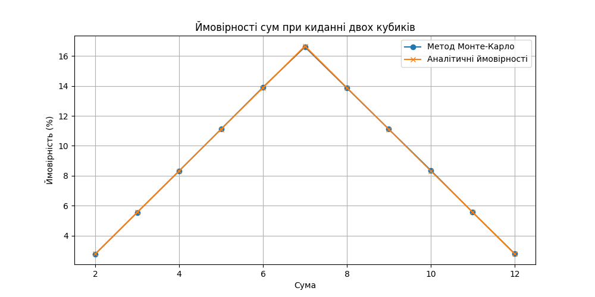

# Алгоритм Монте-Карло. Симуляція кидків кубиків

## Опис завдання
Метою завдання було написати програму на Python, яка використовує метод Монте-Карло для моделювання великої кількості кидків двох кубиків, обчислення сум чисел, що випадають, та визначення ймовірностей кожної можливої суми. Результати симуляції порівнюються з аналітичними розрахунками ймовірностей.

## Результати
Програма симулювала 1,000,000 кидків кубиків і підрахувала ймовірності для кожної суми від 2 до 12. Ось результати симуляції (Метод Монте-Карло) та аналітичні ймовірності:

| Сума | Ймовірність (Монте-Карло) | Ймовірність (Аналітична) |
|------|---------------------------|--------------------------|
| 2    | 2.77%                     | 2.78%                    |
| 3    | 5.55%                     | 5.56%                    |
| 4    | 8.33%                     | 8.33%                    |
| 5    | 11.12%                    | 11.11%                   |
| 6    | 13.92%                    | 13.89%                   |
| 7    | 16.61%                    | 16.67%                   |
| 8    | 13.86%                    | 13.89%                   |
| 9    | 11.11%                    | 11.11%                   |
| 10   | 8.37%                     | 8.33%                    |
| 11   | 5.56%                     | 5.56%                    |
| 12   | 2.80%                     | 2.78%                    |

## Висновки
Результати симуляції за методом Монте-Карло виявились дуже близькими до аналітичних розрахунків ймовірностей. Це підтверджує правильність реалізації алгоритму і демонструє ефективність методу Монте-Карло для оцінки ймовірностей в подібних задачах.

## Візуалізація
Графік нижче показує порівняння ймовірностей сум, отриманих за допомогою методу Монте-Карло та аналітичних розрахунків:

